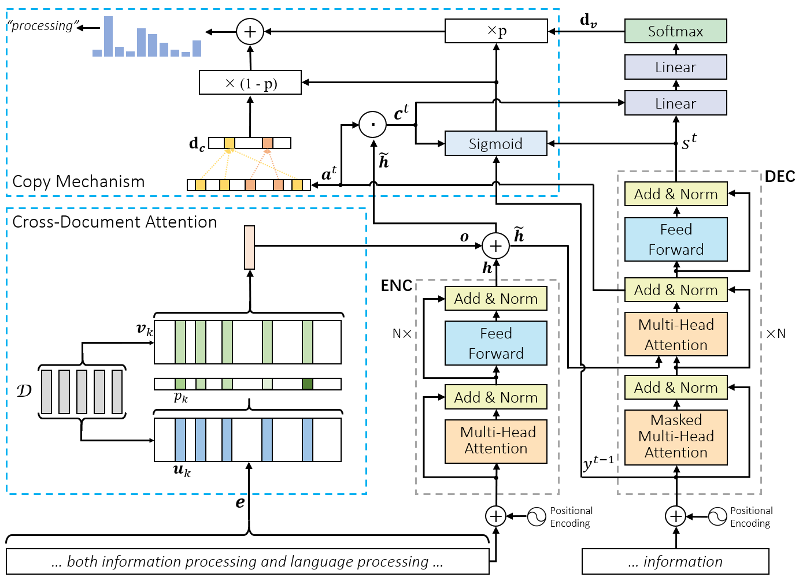

# Keyphrase Generation with Cross-Document Attention

Source code for the paper entitled "Keyphrase Generation with Cross-Document Attention". Our implementation is built on the source code from <a href = "https://github.com/memray/OpenNMT-kpg-release"> OpenNMT-kpg-release</a> and  <a href = "https://github.com/OpenNMT/OpenNMT-py"> OpenNMT-py</a>. 

CDKGen is a Transformer-based keyphrase generator, which expands the Transformer to global attention with cross-document attention networks to incorporate available documents as references so as to generate better keyphrases with the guidance of topic information. On top of the proposed Transformer + cross-document attention architecture, we also adopt a copy mechanism to enhance our model via selecting appropriate words from documents to deal with out-of-vocabulary words in keyphrases. The structure of CDKGen is illustrated in the figure below.



## Citation

If you use or extend our work, please cite the following [**paper**](https://arxiv.org/abs/2004.09800):


```
@article{Sinovation2020CDKGen,
  title="{Keyphrase Generation with Cross-Document Attention}",
  author={Shizhe Diao, Yan Song, Tong Zhang},
  journal={ArXiv},
  year={2020},
  volume={abs/2004.09800}
}
```


### Dependencies
python 3.6

pytorch 1.1

sentence-transformers 0.2.4


### Datasets
All datasets used in this paper are provided by <a href = "https://github.com/memray/OpenNMT-kpg-release"> Rui Meng</a> and they can be downloaded [here](https://drive.google.com/open?id=1UbxCMeIO-SNn9N8buELjsueNAw9pbMwe). 

### Preprocess the data

```bash
python preprocess.py -config config/preprocess/config-preprocess-keyphrase-kp20k.yml
```

### Training

```bash
python train.py -config config/train/config-transformer-keyphrase-memory.yml
```


### Testing

```bash
python kp_gen_eval.py -tasks pred eval report -config config/test/config-test-keyphrase-one2seq.yml -data_dir data/keyphrase/meng17/ -ckpt_dir ./models/kp20k/ -output_dir output/cdkgen/ -testsets duc inspec semeval krapivin nus kp20k -gpu 0 --verbose --beam_size 10 --batch_size 32 --max_length 40 --onepass --beam_terminate topbeam --eval_topbeam
```
